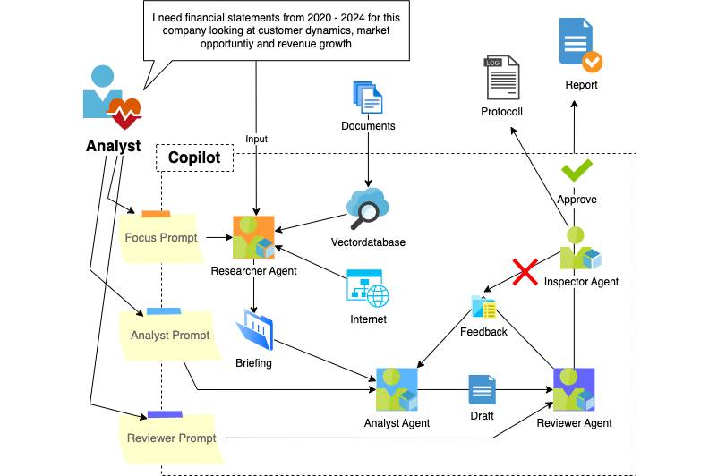

# Financial analysts as a copilot
This repository contains a set of intelligent financial analysts that will collaborate to complete a task based on external input and iterate until a certain quality has been achieved.

We want to use this as a conceptual demo on how multiple configurable agents can help to iterate on an objective to generate outputs and produce a trail of evidence for making internal decisions.

This is what the process looks like:



These are the roles:
- User: Provides the task and defines the references that should be used. He can also override the prompts of the analyst and the reviewer.
- Researcher: Will retrieve and enhance the content that is referenced by the user and will forward the talks and materials to the analyst.
- Analyst: Will write a draft of a possible solution to the objective based on the materials available and will forward his work results along with its internal reasoning and references to the reviewer.
- Reviewer: Will validate if the analyst has solved the objective in the quality, completeness and correctness based on the materials available. He will write feedback based on his findings to the analyst.
- Rater: Will judge if the Analyst has incorporated the feedback by the Reviewer and ensure that the quality of the work output and metadata improves over the iterations.

Regions that this deployment can be executed:
- uksouth
- swedencentral
- canadaeast
- australiaeast

## Quickstart & Infrastructure setup

The following lines of code will connect your Codespace az cli and azd cli to the right Azure subscription:

```
az login

azd auth login

```

Now deploy the infrastructure components with azure cli

```
azd up
```

Get the values for some env variables
```
azd env get-values | grep AZURE_ENV_NAME
source <(azd env get-values)
```

Last but not least: deploy a dummy container in Azure Container Apps. 
```
bash ./azd-hooks/deploy.sh web $AZURE_ENV_NAME

```

## Start locally

```
python -m streamlit run app.py --server.port=8000
```

## Deploy resources for streamlit 

Run the following script

```
azd env get-values | grep AZURE_ENV_NAME
source <(azd env get-values | grep AZURE_ENV_NAME)
bash ./azd-hooks/deploy.sh web $AZURE_ENV_NAME
```
